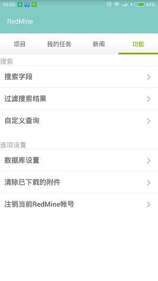
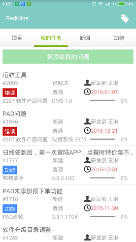
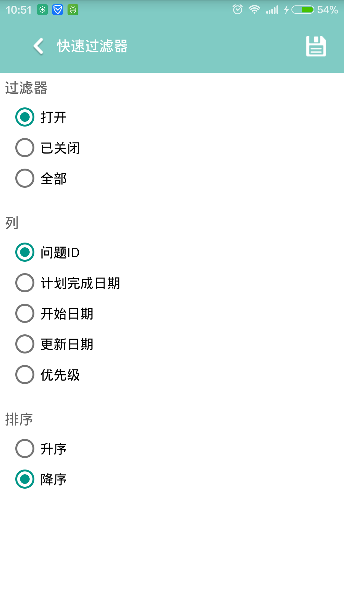
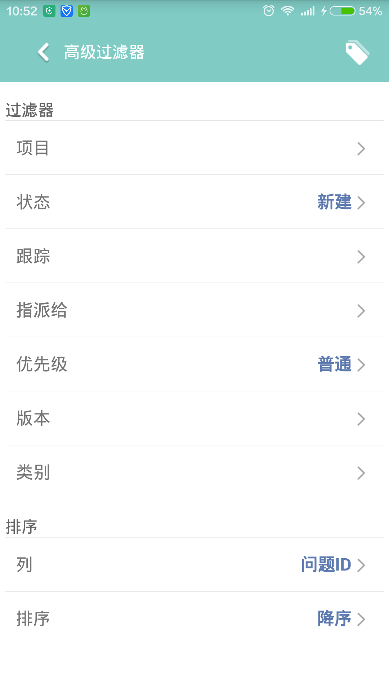
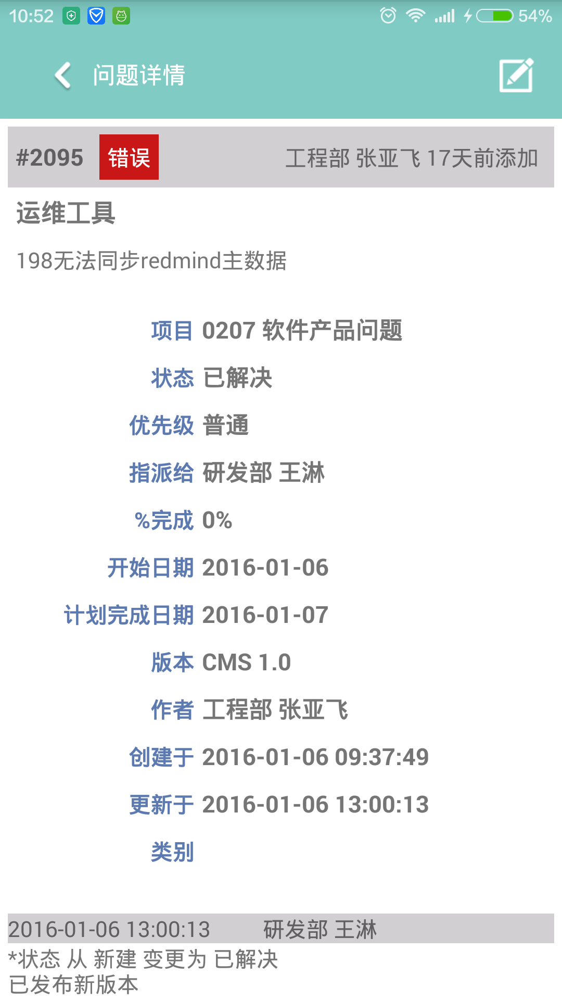

# PhoneRedmine

### 前言
    Redmine是一个开源的项目管理软件，公司办公使用了Redmine进行管理。虽然Redmine有手机版，但是却并不能满足我们的需求。
    于是自己便仿照Redmine的手机版软件自己写完了这个PhoneRedmine的模块并融入到我们的项目之中。
    当然手机版和网页版功能相比还缺少许多功能，但是日常的收发任务、标签过滤等都没有问题。
    
### 特色
    1. PhoneRedmine实现了Redmine手机版一些没有实现的功能，如查看新闻等。
    2. 全项目使用了MaterialDesign风格，沉浸式状态栏，极简页面体验。
    3. 项目暂时只支持一个账户和一个URL。
    4. 根据公司的使用习惯，有些地方显示等做了优化。
    
### 吐槽&感受
    做这个项目纯粹是兴趣使然，公司并没有强制做，但是做的时候发现很有意思，于是便越做越有劲。官方提供的接口有限，
    比如新闻等官方接口没有提供，只能模拟网页登录抓取Html网页内容进行分析。

### IDE
    公司的网超级烂，一直想使用AS，但是下个Gradle都得半个上午，试了几次就放弃了。
    现在还是在用Eclipse，每每看到GitHub的开源一行就能在AS中添加依赖的时候，对公司的网速只能默念几遍神兽了。

### 程序截图

